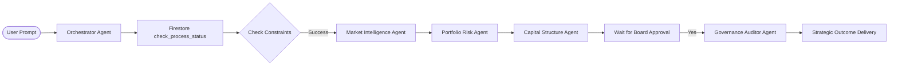

# Capital Allocation Strategy Agent

A multi-agent system built with the [Google Agent Development Kit (ADK)](https://google.github.io/adk-docs/) that automates capital allocation strategy assessment for the C-Suite. It demonstrates sequential multi-agent orchestration, market intelligence diagnostics, portfolio risk validation, and Firestore-backed repair & resume capabilities.

## A. Overview & Functionalities

### Agent Details

| Property             | Value                                       |
| -------------------- | ------------------------------------------- |
| **Interaction Type** | Workflow                                    |
| **Complexity**       | Advanced                                    |
| **Agent Type**       | Multi-Agent (1 orchestrator + 4 sub-agents) |
| **Vertical**         | Financial Services                          |
| **Framework**        | ADK                                         |
| **Model**            | Gemini 3.1 Pro Preview                      |

### Key Features

| Feature                            | Description                                                                                             |
| ---------------------------------- | ------------------------------------------------------------------------------------------------------- |
| **Multi-Agent Orchestration**      | Orchestrator coordinates 4 specialized sub-agents via `AgentTool` in a sequential workflow              |
| **C-Suite Analytics Context**     | Gemini 3.1 Pro Preview evaluates Month-over-Month (MoM) leakage and Tier 1 capital ratios natively      |
| **Structured Strategy Output**     | Each sub-agent returns validated Pydantic models (e.g., `StrategyBoardBriefing`) via `output_schema`     |
| **Executive Decision Tollgate**    | Orchestrator pauses after capital structuring to present results and wait for explicit board approval   |
| **LLM-as-Judge Audit Trace**       | After-agent callback validates trajectory correctness and data grounding before showing responses       |
| **Scenario Repair & Resume**      | Firestore workflow management tracks each step; workflow can pause on edge cases and resume from checkpoint |
| **Visual Validation (Nano Banana)**| Generates visual high-fidelity concepts using image generation tools for board-level design approvals   |

### Key Architecture Pattern (Sequential)



### Example Interaction

**Running a strategic C-Suite query**:

```
User: We are losing 4% MoM in the 'Artisan' segment to Square/Stripe. Analyze our Q1 risk data and external market comps. Identify the 'High-Growth' segment we can win back and propose a proactive capital structure that beats the competition while staying within our Tier 1 capital ratios.

Agent: [Calls check_process_status -> checks constraints]
       [Calls MarketIntelligenceAgent -> analyzes market leakage, synthesize circle/solid mock data]
       [Calls PortfolioRiskAgent -> fetches internal risk metrics, checks Tier 1 > 10.5%]
       [Calls CapitalStructureAgent -> models dynamic rate responses]

       📊 Diagnostic Intelligence:
       - Market Leakage: 4% MoM in Artisan segment to Square/Stripe.
       - Competition Check: Competitors offering 4.5% yield sweep.

       📉 Validated Constraints:
       - Tier 1 Capital: 14.82% (Target > 10.5%). Compliance check PASS.

       📐 Proposed Strategic Capital Proposal:
       - Target Yield Spreads: Pivot simulated rates to 6.5%.
       - Competitor Moat: Push premium banking relationships + sweep yield.
       - Projected IRR: 14.2% (Target: 12.0%).
       - Ratio Impact: -15 bps.

       Shall I finalize the Governance Audit and Briefing Canvas? (yes/no)

User: yes

Agent: [Calls GovernanceAuditorAgent -> finalizes executive memo]

       ✅ Directive STRAT-2026-00142 approved by Governance Committee!
```


## B. CloudNEXT Scenarios & Demo Quiver

Use these 4 curated scenarios to demonstrate the multi-agent system's capabilities in the ADK Web UI:

### 🥇 1. The CloudNEXT Default (Artisan Leakage Analysis)
* **Goal**: Test full sequential multi-agent workflow synthesis.
* **Prompt**:
  > "We are losing 4% MoM in the 'Artisan' segment to Square/Stripe. Analyze our Q1 risk data and external market comps. Identify the 'High-Growth' segment we can win back and propose a proactive capital structure that beats the competition while staying within our Tier 1 capital ratios."

### 🧪 2. The High-Growth Expansion (Fintech Simulation)
* **Goal**: Test if the agent can calibrate exact competitive interest rate impacts using standard market comps.
* **Prompt**:
  > "What is the fastest way to win back the 'B2B Retail / Micro-Merchant' segment? Analyze competing rates from Square and run a capital simulation to find the exact interest rate we should offer to maintain a 12%+ IRR."

### 🛡️ 3. The Risk & Compliance Audit Trace (Safety Check)
* **Goal**: Test constraints when internal risk scores or Tier 1 capital ratios are at risk.
* **Prompt**:
  > "Draft a compliance assessment for shifting 20% of our liquidity to high-yield micro-merchants. Can our Tier 1 capital survive if loss rates spike by 5%? Validate if we breach our 10.5% internal floor."

### 🤖 4. The Direct Action Directive (Human-in-the-Loop)
* **Goal**: Test autonomous synthesis and boardroom memo finalization after user approval lockouts.
* **Prompt**:
  > "Run the standard Q1 Artisan Market Leakage model. Confirm compliance numbers, and if passing, finalize the Governance Memo with the GovernanceAuditorAgent."


## C. Local Setup & Setup Execution

Get your workspace running using standard `uv` commands:

### Prerequisites

- **Python 3.11+**
- **uv** (Dependency management)

```bash
# Clone and enter directory
cd python/agents/capital-allocation-strategy-agent

# Install dependencies and sync virtual environment
uv sync --dev

# Authenticate to GCP and set defaults
gcloud auth application-default login
```

### Running the Agent

```bash
# Launch the ADK Web UI locally
uv run adk web
```
Then open `http://localhost:8000`, select your agent, and paste one of the 4 C-Suite prompts!


## D. Reliability & Evaluation

Ensuring the reliability and accuracy of your C-Suite Agent before boardroom presentations is critical. We use evaluated unit tests and automated LLM judge-based integration test suites.

### Testing

Run tests and coverage using standard scripts:

```bash
# Unit tests
uv run pytest tests/unit

# Integration tests (runs scenarios through live Vertex AI APIs)
uv run pytest tests/integration
```

### LLM-as-Judge Evaluation Strategy

We evaluate outputs using a semantic equivalence threshold rather than rigid exact-match strings.
- **Criteria Quality Threshold**: 0.8 / 1.0 (requires complete output summaries, clear directives, and correct sequential tool order).
- **Grounding and Trajectory enforcement**: If the sub-agents add creatively hallucinated context, the after-agent judge gate auto-blocks compliance breaches.


## E. Deploying to Vertex AI Agent Engine

Use the [Agent Starter Pack](https://goo.gle/agent-starter-pack) to generate production-ready deployment bundles:

```bash
# 1. Initialize deployment templates
uvx agent-starter-pack create my-capital-agent -a local@python/agents/capital-allocation-strategy-agent

# 2. Enter and view deploy directives
cd my-capital-agent
make deploy
```

Copyright 2026 Google LLC. Licensed under the Apache License, Version 2.0.
